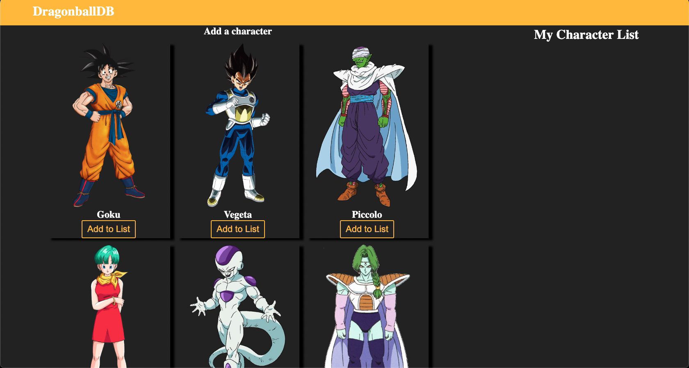

# DragonballDB

is a web application capable of fetching data from Dragon Ball API and saves the data to my database.
[Original wireframe](https://www.figma.com/file/M4DQnGz97kSnGVAxwlFGVJ/Untitled?type=design&mode=design&t=Tu71GdPXaiM2iQO1-0)

# Technologies used

- HTML
- CSS
- PostgreSQL
- React
- Express
- Node

